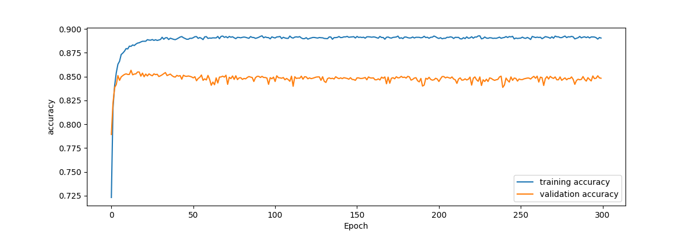
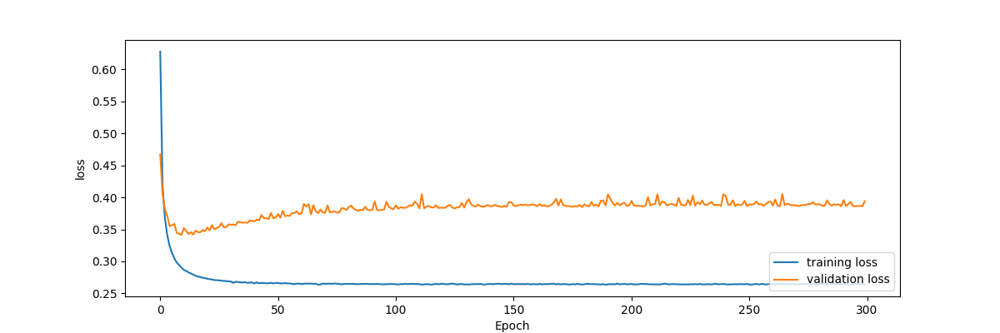

# IMDB Large Movie Review Dataset

Created for assignment #1 of CMPUT 651 (Deep Learning for Natural Language Processing) at the University of Alberta during the Winter term of 2021.

The original data can be found here: [Large Movie Review Dataset](http://ai.stanford.edu/~amaas/data/sentiment/).

The goal of this project is to build a train-validation-test infrastructure from the given data and then train a logistic regression model on the data. 

Our dataset consists of 50000 movie reviews, where 25000 are positive and 25000 are negative. This is split into 25000 (12500 positive + 12500 negative) for the training set and the rest for the testing set. We further divide the training set in order to have a validation set to tune our model's parameters on. The table below shows the final split up.

|            | Positive | Negative | Total |
|------------|----------|----------|-------|
| Train      | 10000    | 10000    | 20000 |
| Validation | 2500     | 2500     | 5000  |
| Test       | 12500    | 12500    | 25000 |

## Process

1. Preprocess the data by lowercasing all text and separating them based on spaces.
2. Assign a label of 1 for positive sentiment and 0 for negative sentiment.
3. Create a vocabulary of the 2000 most common words.
4. Convert the sentences into a feature vector of dimension 2000. Each dimension of this vector corresponds to the presence of the 2000 most common words in the vocabulary. If the word is present, the corresponding dimension is set to 1. Otherwise it is set to 0.
5. Train a logistic regression model with learning rate 0.1, batch size of 20, uniform random initialization of weights in [-0.5, 0.5] over 300 epochs.

## Results
---

Training vs Validation Accuracy

Training vs Validation Loss

We see that our final test accuracy = 0.85012

## Other Work

I performed experiments with setting the bias to 1 or using 0 initialization for weights. However the problem seems to be simple enough that after 300 epochs there is no significant difference in the results. Note that the results shown above are from taking the best epoch (based on validation accuracy) after training the model for 300 epochs. As seen in the image, the 13th epoch was the best.

## Usage

Simply create a new environment from `requirements.txt` and run `main.py`. The script takes in 3 command line arguments - training_data, validation_data, and testing_data. Apart from this, the first few lines of the script detail the possible parameters that can be tuned. 

Note that it expects the data to be pickle files, each of which are a tuple (features, labels). Features must be an array of shape (N_data, N_features). Labels must be an array of shape (N_data) where each element is binary. 

The code is general enough that it should not require any changes for different datasets, but no guarantees are provided.